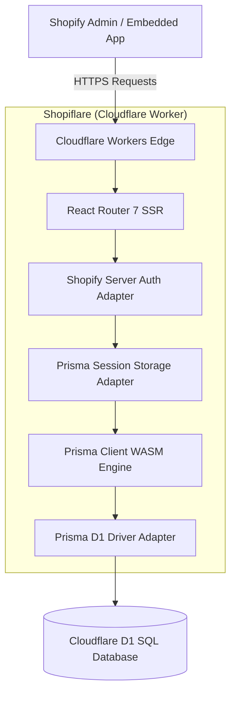

# 🛍️⚡ Shopiflare

**The production-grade Shopify App template built on React Router 7 and Cloudflare Workers, powered by Prisma ORM and Cloudflare D1 SQL.**

---

## 📖 Overview

**Shopiflare** is a modern, high-performance foundation for building full-stack Shopify Apps deployed directly to [Cloudflare Workers](https://workers.cloudflare.com/). 

Traditional serverless Node.js Shopify apps often suffer from cold-start latencies and high container hosting costs. Meanwhile, previous Edge templates suffered from Key-Value (KV) eventual-consistency race conditions, request context bleeding (`globalThis`), and native Rust query engine binary incompatibilities.

Shopiflare solves all of these challenges:
* ⚡ **Ultra-Fast Global Edge Execution**: Sub-10ms response times worldwide via Cloudflare Workers V8 isolates.
* 🗄️ **Relational SQL via Cloudflare D1 & Prisma**: Read-your-writes consistency with Cloudflare D1 SQLite databases using Prisma ORM compiled with pure **WebAssembly (WASM)**.
* 🛡️ **Zero Request Bleeding**: Context-isolated Shopify instances injected per request via React Router `AppLoadContext` (no unsafe global state mutations).
* 🏬 **Automatic Store Sync**: Automatically queries and persists store metadata (plan, timezone, email, currency) into a dedicated `Shop` SQL table upon OAuth install.
* 🌐 **Multi-Environment Ready**: Out-of-the-box configuration and scripts for **Local**, **Staging**, and **Production** environments across both Cloudflare and Shopify Partner Dashboards.

---

## 🏗️ Architecture



* **Frontend**: React 18, React Router 7, Shopify App Bridge React.
* **Edge Runtime**: Cloudflare Workers with `@cloudflare/vite-plugin`.
* **Database & ORM**: Cloudflare D1 SQLite + Prisma ORM (WASM Query Engine + `@prisma/adapter-d1`).
* **Session Persistence**: Custom `PrismaSessionStorage` implementing Shopify's official `SessionStorage` interface with typed serialization.

---

## 📂 Project Structure

```
├── app/
│   ├── routes/                     # React Router file-based routes
│   │   ├── _index/                 # Landing / Login route
│   │   ├── app._index.tsx          # Main Embedded Admin Dashboard
│   │   ├── auth.$.tsx              # Shopify OAuth & Store Metadata Auto-Sync
│   │   ├── auth.login/             # Merchant Login Form
│   │   └── webhooks.app.*.tsx      # Webhook Handlers (uninstalled, scopes_update)
│   ├── db.server.ts                # Per-request Prisma Client factory (D1 adapter)
│   ├── session-storage.server.ts   # Custom Prisma D1 Session Storage implementation
│   ├── shopify.server.ts           # Dynamic Shopify App API instance factory
│   ├── root.tsx                    # Root Layout & App Bridge Provider
│   └── entry.server.tsx            # React Router SSR Entrypoint
├── migrations/                     # Raw D1 SQL migrations (0001_init.sql)
├── prisma/
│   └── schema.prisma               # Prisma Schema (Session & Shop models)
├── workers/
│   └── app.ts                      # Cloudflare Worker entrypoint & Context forwarder
├── shopify.app.dev.toml            # Shopify CLI configuration for Local Development
├── shopify.app.staging.toml        # Shopify CLI configuration for Staging
├── shopify.app.toml                # Shopify CLI configuration for Production
├── wrangler.jsonc                  # Cloudflare Worker & D1 Multi-Environment config
└── vite.config.ts                  # Vite config with Prisma WASM aliases & SSR bundling
```

---

## 🌍 Multi-Environment Topology

| Environment | Cloudflare Worker | D1 Database | Shopify App Config | Git Branch |
|---|---|---|---|---|
| **Local** | `wrangler dev` (Vite Plugin) | Local D1 Emulation (`.wrangler/state`) | `shopify.app.dev.toml` | Working Branch (`feature/*`) |
| **Staging** | `shopiflare-staging` | `shopify-app-db-staging` | `shopify.app.staging.toml` | `staging` |
| **Production** | `shopiflare` | `shopify-app-db` | `shopify.app.toml` | `main` |

---

## 🚀 Getting Started

### 1. Prerequisites
Ensure you have the following installed:
* [Node.js](https://nodejs.org/) (>= 20.19 or >= 22.12)
* [Shopify CLI](https://shopify.dev/docs/apps/tools/cli): `npm install -g @shopify/cli`
* [Cloudflare Wrangler](https://developers.cloudflare.com/workers/wrangler/): `npm install -g wrangler`
* *(Optional)* [cloudflared](https://developers.cloudflare.com/cloudflare-one/connections/connect-networks/get-started/): For exposing your local server to Shopify OAuth.

### 2. Installation
Clone the repository and install dependencies:
```bash
npm install
```

### 3. Generate Prisma Client
Generate the WebAssembly-enabled Prisma client:
```bash
npm run db:generate
```

---

## 🔐 Environment Variables & Secrets

Cloudflare Workers distinguish between plain environment variables (`vars` in `wrangler.jsonc`) and encrypted secrets.

### Local Development (`.dev.vars`)
Create a `.dev.vars` file in the root directory (gitignored):
```env
SHOPIFY_API_KEY=your_dev_shopify_api_key
SHOPIFY_API_SECRET=your_dev_shopify_api_secret
SCOPES=write_products
```

### Staging & Production Secrets
Upload your Shopify API credentials as encrypted Cloudflare Worker secrets:

```bash
# Staging Secrets
npx wrangler secret put SHOPIFY_API_KEY --env staging
npx wrangler secret put SHOPIFY_API_SECRET --env staging

# Production Secrets
npx wrangler secret put SHOPIFY_API_KEY --env production
npx wrangler secret put SHOPIFY_API_SECRET --env production
```

---

## 🗄️ Database Setup & Migrations

### 1. Create Cloudflare D1 Databases
If setting up new databases:
```bash
# Create Production Database
npx wrangler d1 create shopify-app-db

# Create Staging Database
npx wrangler d1 create shopify-app-db-staging
```
*Paste the generated `database_id` values into the corresponding blocks in [`wrangler.jsonc`](/wrangler.jsonc).*

### 2. Apply Database Migrations
Shopiflare includes the SQL migrations under `migrations/0001_init.sql`.

```bash
# Apply to Local D1 database
npm run db:migrate:local

# Apply to Remote Staging D1 database
npm run db:migrate:staging

# Apply to Remote Production D1 database
npm run db:migrate:production
```

### 3. Modifying the Schema
When adding new models to `prisma/schema.prisma`:
1. Generate the SQL migration diff:
   ```bash
   npx prisma migrate diff --from-empty --to-schema-datamodel ./prisma/schema.prisma --script --output migrations/0002_new_feature.sql
   ```
2. Re-generate the Prisma client:
   ```bash
   npm run db:generate
   ```
3. Apply to your environments (`local`, `staging`, `production`).

---

## 💻 Local Development Workflow

Because Cloudflare Workers Vite plugin simulates D1 and Worker bindings directly inside Vite, you can run the full app locally:

1. **Start the local Dev Server**:
   ```bash
   npm run dev:cf
   ```
   *Your server will start at `http://localhost:8787` with local D1 database emulation.*

2. **Start a Cloudflare Tunnel**:
   In a separate terminal, expose your local dev server:
   ```bash
   cloudflared tunnel --url http://localhost:8787
   ```
   *Copy the generated `https://*.trycloudflare.com` URL.*

3. **Update `shopify.app.dev.toml`**:
   Set `application_url` and `redirect_urls` to your tunnel URL.

4. **Link & Test in Shopify Partner Dashboard**:
   ```bash
   shopify app config use dev
   shopify app dev
   ```

---

## 🚢 Deployment & CI/CD

### Deploy Code to Cloudflare Workers

```bash
# Deploy to Staging Worker (https://shopiflare-staging.scrptble.workers.dev)
npm run deploy:staging

# Deploy to Production Worker (https://shopiflare.scrptble.workers.dev)
npm run deploy:production
```

### Deploy App Configuration to Shopify
Whenever you modify scopes, app URLs, or webhook declarations in your TOML files, sync them with Shopify:

```bash
# Deploy Staging Shopify App Config
npm run deploy:shopify:staging

# Deploy Production Shopify App Config
npm run deploy:shopify:production
```

---

## 🔄 Recommended Git & CI/CD Pipeline

```
feature/*  ──► PR to `staging` (automated tests run)
                    │
                    ▼ (merge)
                 staging  ──► Auto-deploys to `shopiflare-staging` + `shopify-app-db-staging`
                    │         (Test on development stores)
                    │
                    ▼ (merge after QA)
                  main    ──► Auto-deploys to `shopiflare` + `shopify-app-db`
```

### Cloudflare Workers Builds Integration:
1. Connect your GitHub repository to Cloudflare Workers.
2. **Project 1 (`shopiflare-staging`)**:
   - Production branch: `staging`
   - Build command: `npm run build`
   - Deploy command: `npx wrangler deploy --env staging`
3. **Project 2 (`shopiflare`)**:
   - Production branch: `main`
   - Build command: `npm run build`
   - Deploy command: `npx wrangler deploy --env production`

---

## ⚙️ Available Scripts

| Script | Description |
|---|---|
| `npm run dev:cf` | Starts the local React Router dev server with Cloudflare Workers emulation |
| `npm run build` | Builds the client and server bundles using Vite SSR |
| `npm run deploy:staging` | Builds and deploys the worker to the **Staging** environment |
| `npm run deploy:production` | Builds and deploys the worker to the **Production** environment |
| `npm run db:generate` | Generates the WebAssembly Prisma client |
| `npm run db:migrate:local` | Applies SQL migrations to the local D1 database |
| `npm run db:migrate:staging` | Applies SQL migrations to remote staging D1 database |
| `npm run db:migrate:production`| Applies SQL migrations to remote production D1 database |
| `npm run deploy:shopify:staging` | Pushes staging app scopes, webhooks, and URLs to Shopify |
| `npm run deploy:shopify:production` | Pushes production app scopes, webhooks, and URLs to Shopify |
| `npm run typecheck` | Runs TypeScript typechecker and React Router typegen |

---

## 🧩 Technical Gotchas & Solutions Implemented

* **Prisma Engine on Edge**: `prisma/schema.prisma` is configured with `engineType = "wasm"`. Vite aliases `#wasm-engine-loader` and `.prisma/client` to compile `query_engine_bg.wasm` directly into the worker asset bundle, eliminating OpenSSL / `libssl` dependencies.
* **`__dirname` Polyfill**: Vite is configured with `define: { __dirname: '""' }` to prevent Node CJS library crashes in pure ESM Edge isolates.
* **Serialization Safety**: `app/session-storage.server.ts` uses explicit `sessionToRow` and `rowToSession` mapping to convert Shopify Session objects (including nested `onlineAccessInfo`) into flat SQL rows without Prisma schema rejections.
* **No `globalThis` Bleed**: Shopify API instances are instantiated on-demand per request using `env` from `AppLoadContext`, ensuring multiple merchant requests never share or bleed API tokens.

---

## 📄 License
MIT
